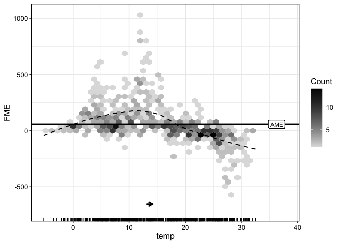

<!-- README.md is generated from README.Rmd. Please edit that file -->
<!-- badges: start -->

[](https://www.repostatus.org/#active)
[](https://www.r-pkg.org/badges/version-last-release/fmeffects)
[](https://github.com/holgstr/fme/actions/workflows/R-CMD-check.yaml)
[](https://cranlogs.r-pkg.org/badges/grand-total/fmeffects)
<!-- badges: end -->

# **`fmeffects`**: An R Package for Forward Marginal Effects 

This package implements [forward marginal effects
(FMEs)](https://arxiv.org/abs/2201.08837), a model-agnostic framework
for interpreting feature effects in machine learning models. FMEs are
the simplest and most intuitive way to interpret feature effects - we
explain
[here](https://holgstr.github.io/fmeffects/articles/fme_theory.html) how
they are computed and why they should be preferred to existing methods.
Currently, `fmeffects` supports 100+ regression and (binary)
classification models:

- All models from the
  [tidymodels](https://www.tidymodels.org/find/parsnip/),
  [mlr3](https://mlr3learners.mlr-org.com/) and
  [caret](https://topepo.github.io/caret/available-models.html)
  libraries.
- Native support for `lm`-type models, e.g. `glm` or `gam`.

## Installation

**CRAN:**

``` r
install.packages("fmeffects")
```

**GitHub:**

``` r
if (!require("remotes")) {
  install.packages("remotes")
}
remotes::install_github("holgstr/fmeffects")
```

## Quickstart

See [here](https://holgstr.github.io/fmeffects/articles/fmeffects.html)
for an in-depth tutorial. The big advantage of FMEs is that they are
interpreted similar to beta coefficients in linear regression models.
Consider the following example: how does an increase in temperature
(`temp`) by 1°C affect bike rentals (`count`)?

``` r
set.seed(123)
library(fmeffects)
data(bikes)
```

### Train a Model

#### `tidymodels`

``` r
# Train a model with tidymodels:
library(tidymodels)
forest <- rand_forest() %>%
  set_mode("regression") %>%
  set_engine("ranger")
forest <- forest %>% fit(count ~ ., data = bikes)
```

#### `mlr3`

``` r
# Train a model with mlr3:
library(mlr3verse)
task <- as_task_regr(x = bikes, id = "bikes", target = "count")
forest <- lrn("regr.ranger")$train(task)
```

### 

### Compute effects

``` r
effects <- fme(model = forest,
              data = bikes,
              feature = "temp",
              step.size = 1)
summary(effects)
#> 
#> Forward Marginal Effects Object
#> 
#> Step type:
#>   numerical
#> 
#> Features & step lengths:
#>   temp, 1
#> 
#> Extrapolation point detection:
#>   none, EPs: 0 of 727 obs. (0 %)
#> 
#> Average Marginal Effect (AME):
#>   2.4411
```

### Plot effects

``` r
plot(effects)
```

<!-- -->

On average, an increase in temperature by 1°C results in an increase in
the predicted number of bike rentals by more than 2. This is called the
average marginal effect (AME).

### Model Overview

Let’s compute the AME for every feature of the model:

``` r
overview <- ame(model = forest,
               data = bikes)
summary(overview)
#> 
#> Model Summary Using Average Marginal Effects:
#> 
#>       Feature step.size       AME      SD      0.25      0.75   n
#> 1      season    spring  -25.5549 27.3998    -32.45   -5.9315 548
#> 2      season    summer    0.7093 21.1565   -7.6447   11.6903 543
#> 3      season      fall   10.1952 26.8142   -3.4281   32.8187 539
#> 4      season    winter   15.0809 23.8147    1.0429   26.4387 551
#> 5        year         0  -99.2488 67.1833 -158.9906  -20.4887 364
#> 6        year         1   96.7449 60.1848   22.3911  147.3953 363
#> 7       month         1     3.972 13.3527   -1.2051    7.0222 727
#> 8     holiday     False   -1.2738 20.6053  -12.3941   13.8391  21
#> 9     holiday      True  -12.6624   24.82  -31.2439    7.6505 706
#> 10    weekday       Sat  -55.4373   49.01  -87.0245  -17.8073 622
#> 11    weekday       Sun  -84.0272 55.8122 -120.5427  -33.0282 622
#> 12    weekday       Mon   11.8773  29.037   -8.0628   32.0552 623
#> 13    weekday       Tue   18.4042 25.4493    0.5363   34.5578 625
#> 14    weekday       Wed   20.9593 23.3927    1.3587   35.6727 623
#> 15    weekday       Thu    20.424 24.6661   -0.2019   37.0423 624
#> 16    weekday       Fri     2.156 36.5116  -25.2143   32.6578 623
#> 17 workingday     False -202.7007 90.6191 -255.7437 -139.1033 496
#> 18 workingday      True  161.4155 64.4276   119.987  208.2005 231
#> 19    weather     clear   26.4157 42.2183    4.0505   24.5175 284
#> 20    weather     misty    2.8201 33.2774   -9.2876    0.7728 513
#> 21    weather      rain  -56.4571 53.9396  -95.1849   -5.5318 657
#> 22       temp         1    2.4411  7.3702   -0.6545    4.8451 727
#> 23   humidity      0.01   -0.2313  2.5498   -0.3944    0.4116 727
#> 24  windspeed         1    0.0453  2.5067   -0.1638    0.3046 727
```
